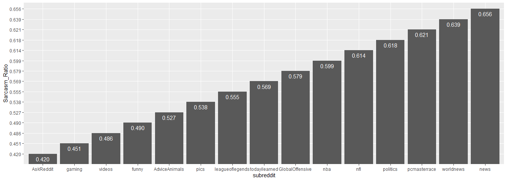
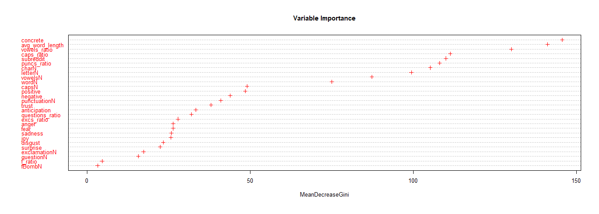
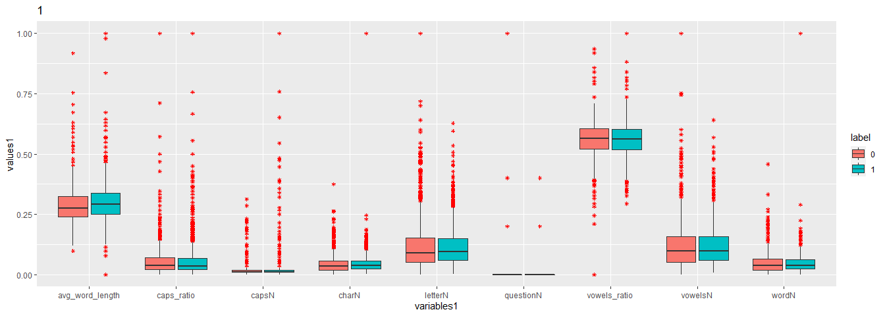
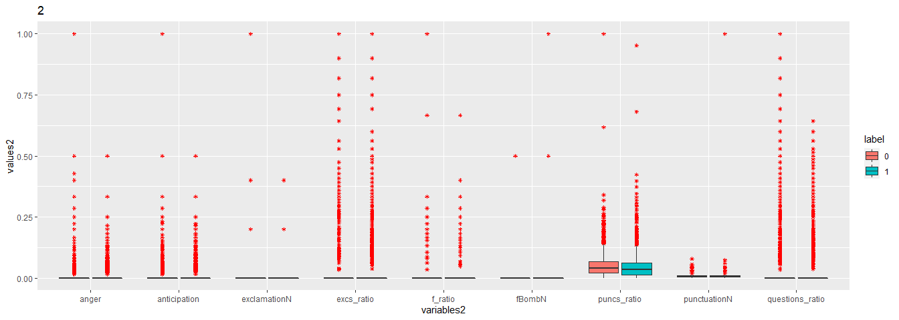
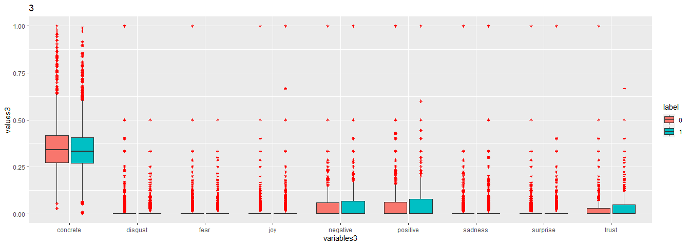
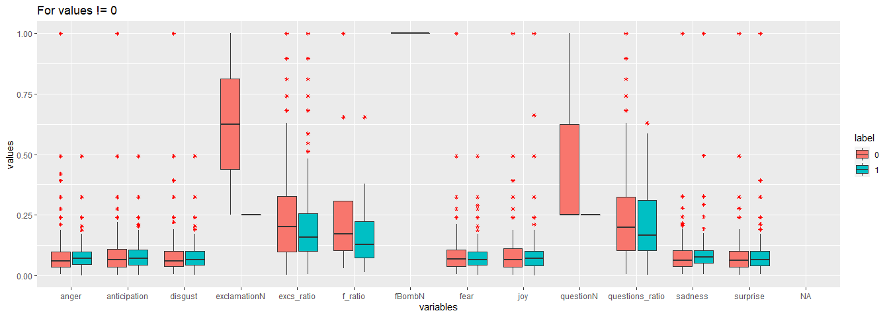
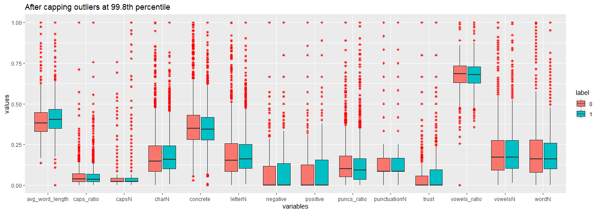

Final Project: Intro to Data Science Course
================
2022-06-17

``` r
# setup
library(dplyr)
library(caret)
library(ggplot2)
library(tidyverse)
library(randomForest)
library(ranger)
library(vistributions)
full_train <- read.csv("C:\\Users\\97252\\Documents\\Final proyect\\train.csv")
test <- read.csv("C:\\Users\\97252\\Documents\\Final proyect\\test.csv")
```

## Intro

This work was my final project in the *Intro to Data Science* course
taught at Ben-Gurion University. We were given a dataset comprised of
various features extracted from Reddit comments and tasked with building
a classification model to predict whether or not a comment is sarcastic.

Some notes:

-   The task was structured as a Kaggle competition with a labeled train
    set and an unlabeled test set.
-   The comment text itself was omitted from the dataset, rendering NLP
    methods irrelevant.
-   The predictive potential of the given data is very poor, with the
    first place scores being **0.61** for the public leaderboard and
    **0.65** for the private one.

## Data Processing and Exploratory Data Analysis

I started by exploring the data to help me make educated decisions in
the pre-processing and feature selection stages. Merging the train and
test set:

``` r
labeled_test <- test %>%
  mutate(label=2)
merged_data <- rbind(full_train, labeled_test)
```

I looked for the following:

-   Variable Importance (which variables can predict sarcasm?)
-   Potential outliers

### Variable Importance

The first feature I examined was *subreddit*. I wanted to see how the
ratio of sarcastic to non-sarcastic comments varies among the different
subreddits:

``` r
onlysubreddits <- full_train[,2:3]
subreddit_ratios <- onlysubreddits %>%
  group_by(subreddit) %>%
  summarise(Sarcasm_Ratio = mean(label))
subreddit_ratios <- arrange(subreddit_ratios, Sarcasm_Ratio) # sorts in descending order
subreddit_ratios$Sarcasm_Ratio <- format(round(subreddit_ratios$Sarcasm_Ratio, 3), nsmall = 3) # rounds ratios to 3 decimal pts

# bar plot
subreddit_ratios %>%
  mutate(subreddit = factor(subreddit, levels = unique(subreddit))) %>% # to sort the bars in ascending order
  ggplot(., aes(x = subreddit, y = Sarcasm_Ratio)) +
  geom_bar(stat="identity") +
  geom_text(aes(label=Sarcasm_Ratio), vjust=1.6, color="white", size=4)
```

<!-- -->

We can see that *AskReddit* is the least sarcastic, while *news* leads
in sarcasm.

Next I ran a random forest variable importance test:

``` r
full_train$label <- as.factor(full_train$label)
train_rf <- randomForest(formula = label ~ .- ID, data = full_train)
varImpPlot(train_rf, pch = 3, col = "red", cex = 0.8, main = "Variable Importance")
```

<!-- -->

Initially I tried removing only *f_ratio* and *fBombN*, but after
training several models and comparing results, I decided to remove a
larger portion of the features to reduce dimensionality. I used *Boruta*
to help weed out the least effective variables.

``` r
library(Boruta)
# Decide if a variable is important or not using Boruta
boruta_output <- Boruta(label ~ ., data=full_train, doTrace=0)  # perform Boruta search
boruta_signif <- names(boruta_output$finalDecision[boruta_output$finalDecision %in% c("Confirmed", "Tentative")])  # collect Confirmed and Tentative variables

# The variables which passed the Boruta significance test:
print(boruta_signif)
```

    ##  [1] "subreddit"       "charN"           "wordN"           "letterN"        
    ##  [5] "avg_word_length" "caps_ratio"      "vowelsN"         "questionN"      
    ##  [9] "exclamationN"    "punctuationN"    "questions_ratio" "excs_ratio"     
    ## [13] "puncs_ratio"     "anticipation"    "concrete"

### Outliers

I started by using boxplots to see if there are visible differences in
the distributions with respect to *label*.

``` r
process_data <- function(df) {
  preproc <- df[3:ncol(df)]
  preProcess_range <- preProcess(preproc, method='range')
  preproc <- predict(preProcess_range, newdata = preproc)
  df <- data.frame(df[1:2], preproc)
  return(df)
}
scaled_train <- process_data(full_train)  # scaling all variables to 0-1 so they fit side-by-side.

longer_train <- scaled_train %>%
  pivot_longer(., 4:12, names_to = "variables1", values_to = "values1") %>%
  pivot_longer(., 4:12, names_to = "variables2", values_to = "values2") %>%
  pivot_longer(., 4:12, names_to = "variables3", values_to = "values3")
  
ggplot(longer_train, aes(variables1, values1,fill=label)) + geom_boxplot(outlier.colour="red", outlier.shape=8, outlier.size=1) + labs(title = "1")
```

<!-- -->

``` r
ggplot(longer_train, aes(variables2, values2,fill=label)) + geom_boxplot(outlier.colour="red", outlier.shape=8, outlier.size=1) + labs(title = "2")
```

<!-- -->

``` r
ggplot(longer_train, aes(variables3, values3,fill=label)) + geom_boxplot(outlier.colour="red", outlier.shape=8, outlier.size=1) + labs(title = "3")
```

<!-- -->

Looking at the graphs we see the following:

-   The variables with visibly different means (represented by the black
    lines in each box) with regards to label are: *avg_word_length*,
    *letterN*, *vowels_ratio*, *puncs_ratio* and *concrete*. We expect
    these variables to have better predictive power.
-   Almost half of the plots are distorted due to the variables’ IQR
    being zero (the boxplot is flat).
-   We can see that there are many outliers which may negatively impact
    our model.

After much trial and error, I decided it’s best to cap the outliers at
the 99.8th percentile. This rids us of truly extreme values while not
flattening our data too much.

In addition, I took all the variables with an IQR of zero and looked
only at the distribution of values greater than zero:

``` r
capped_merged_data <- full_train
limited_vars <- c()
for (i in 4:30) {
  iqr <- IQR(capped_merged_data[,i])
  if (iqr == 0) {
          limited_vars <- append(limited_vars, i)
  }
}
limited_data <- capped_merged_data[,limited_vars]
rest_of_data <- capped_merged_data[,-limited_vars]
rest_of_data$label <- as.factor(rest_of_data$label)
limited_data <- cbind(rest_of_data[,1:3], limited_data)

for (i in 4:17) {
  q <- quantile(rest_of_data[,i], probs=.998)
  rest_of_data[,i] <- ifelse(rest_of_data[,i] > q, q, rest_of_data[,i])
}

for (i in 4:16) {
  limited_data[,i] <- ifelse(limited_data[,i] == 0, NA, limited_data[,i])
}

limited_data <- limited_data %>%
  process_data(.) %>%
  pivot_longer(., 4:16, names_to = "variables", values_to = "values")
limited_data <- limited_data[limited_data$values != 0,]
  
ggplot(limited_data, aes(variables, values,fill=label)) + geom_boxplot(outlier.colour="red", outlier.shape=8, outlier.size=1) + labs(title = "For values != 0")
```

<!-- -->

Now we can clearly see some differences; particularly in *exclamationN*,
*excs_ratio*, *f_ratio*, *questionN* and *questions_ratio*. However, we
must keep in mind that this graph does not take into account the amount
of examples. For example - *f_ratio* may look like a good predictor, but
in reality there are fewer than 50 rows with values greater than zero.

As for the outliers:

``` r
rest_of_data <- rest_of_data %>%
  process_data(.) %>%
  pivot_longer(., 4:17, names_to = "variables", values_to = "values")
ggplot(rest_of_data, aes(variables, values,fill=label)) + geom_boxplot(outlier.colour="red", outlier.shape=8, outlier.size=1) + labs(title = "After capping outliers at 99.8th percentile")
```

<!-- -->

We can see that capping the outliers (even very lightly) stretches out
our boxes and emphasizes the differences.

### Feature Engineering

For a long time I tried working with all the features, only removing
*fBombN* and *f_ratio* under the assumption that there are not enough
examples for these features to be effective.

In the end I decided to heavily reduce the dimensions of the data by
removing the less important features based on the tests I conducted (*RF
Importance*, *Boruta*).

Finally, I decided to create two new features by modifying some existing
ones:

-   consonantN

Realizing that *vowelsN* is a subset of *letterN*, I defined
*consonantN* to be *letterN* - *vowelsN* and subsequently removed
*letterN*.

-   whitespaceN

While visually inspecting the data I looked at *charN* and figured it
should amount to the sum of the other character variables in addition to
the spaces between words (taken to be *wordN* - 1). After realizing that
in many cases *charN* doesn’t add up (possibly due to excess
spaces/returns), I decided to define the new variable *whitespaceN* to
be:

*charN* - (*letterN* + *punctuationN* + *questionN* + *exclamationN*)

Features taken:

``` r
features <- c("subreddit", "avg_word_length", "caps_ratio", "vowelsN", "questionN", "exclamationN", "punctuationN", "questions_ratio", "excs_ratio", "puncs_ratio", "anticipation", "concrete")

# consonantN and whitespaceN added in the next section
```

### Data Pre-Processing

-   Capping outliers at the 99.8th percentile
-   Caret’s ‘range’ method (making all values range between 0-1)
-   One-hot encoding the subreddits (not used in the final model)

Possibly the most important step here was to pre-process the train and
test sets together (as a merged data-frame with 4757 rows) before
separating them again for training. This ensured they were processed in
the same exact way.

``` r
data <- merged_data[,c("label", features)]
data <- mutate(data, consonantN = (merged_data$letterN - merged_data$vowelsN), whitespaceN = (merged_data$charN - merged_data$letterN - merged_data$punctuationN - merged_data$questionN - merged_data$exclamationN))
data$whitespaceN <- ifelse(data$whitespaceN < 0, 0, data$whitespaceN)
for (i in 3:ncol(data)) {
  q <- quantile(data[,i], probs=.998)
  data[,i] <- ifelse(data[,i] > q, q, data[,i])
}

data <- data %>%
  process_data(.)

data.train <- filter(data, label < 2)
data.test <- filter(data, label > 1)
data.test$label <- NULL
data.test$ID <- NULL
data.train$ID <- NULL

set.seed(15)
split_point <- rbinom(nrow(data.train), 1, 0.8)
data.devtrain <- data.train[split_point==1,] # Train
data.devtest <- data.train[split_point==0,] # Test

data.devtrain$label <- as.factor(data.devtrain$label)
data.devtest$label <- as.factor(data.devtest$label)
data.train$label <- as.factor(data.train$label)
data.devtrain$ID <- NULL
data.devtest$ID <- NULL
```

## Training

I tried various models, eventually settling on the Support Vector
Machine. After splitting the train set into dev_train and dev_test, I
got to work tuning the model. The final model parameters chosen were:

-   SVM Polynomial kernel with degree 2
-   0.01 Scale
-   C = 7

``` r
my_trC <- trainControl(method='cv', number=5)
params <- expand.grid(degree = 2, scale = 0.01, C = 7)

fit_svm <- train(label ~ .,
                data=data.devtrain,
                method='svmPoly',
                trControl=my_trC,
                tuneGrid=params
                )
fit_svm
```

    ## Support Vector Machines with Polynomial Kernel 
    ## 
    ## 2603 samples
    ##   14 predictor
    ##    2 classes: '0', '1' 
    ## 
    ## No pre-processing
    ## Resampling: Cross-Validated (5 fold) 
    ## Summary of sample sizes: 2082, 2082, 2083, 2083, 2082 
    ## Resampling results:
    ## 
    ##   Accuracy   Kappa    
    ##   0.6016034  0.1849627
    ## 
    ## Tuning parameter 'degree' was held constant at a value of 2
    ## Tuning
    ##  parameter 'scale' was held constant at a value of 0.01
    ## Tuning parameter
    ##  'C' was held constant at a value of 7

Testing on my own developer test set:

``` r
preds <- predict(fit_svm, data.devtest)
confusionMatrix(reference = data.devtest$label, data = preds, mode='everything', positive='1')
```

    ## Confusion Matrix and Statistics
    ## 
    ##           Reference
    ## Prediction   0   1
    ##          0 153  97
    ##          1 166 295
    ##                                           
    ##                Accuracy : 0.6301          
    ##                  95% CI : (0.5934, 0.6657)
    ##     No Information Rate : 0.5513          
    ##     P-Value [Acc > NIR] : 1.249e-05       
    ##                                           
    ##                   Kappa : 0.2369          
    ##                                           
    ##  Mcnemar's Test P-Value : 2.752e-05       
    ##                                           
    ##             Sensitivity : 0.7526          
    ##             Specificity : 0.4796          
    ##          Pos Pred Value : 0.6399          
    ##          Neg Pred Value : 0.6120          
    ##               Precision : 0.6399          
    ##                  Recall : 0.7526          
    ##                      F1 : 0.6917          
    ##              Prevalence : 0.5513          
    ##          Detection Rate : 0.4149          
    ##    Detection Prevalence : 0.6484          
    ##       Balanced Accuracy : 0.6161          
    ##                                           
    ##        'Positive' Class : 1               
    ## 

### Secondary Model

Weighted random forest:

``` r
#Computing weights to balance the RF
w <- 1/table(data.train$label)
w <- w/sum(w)
weights <- rep(0, nrow(data.train))
weights[data.train$label == 0] <- w['0']
weights[data.train$label == 1] <- w['1']
table(weights, data.train$label)
```

    ##                    
    ## weights                0    1
    ##   0.452625226312613    0 1814
    ##   0.547374773687387 1500    0

The model itself:

``` r
ranger_rf <- ranger(label~., data = data.train,
                    case.weights=weights,
                    num.trees = 500,
                    regularization.usedepth=TRUE)
ranger_rf
```

    ## Ranger result
    ## 
    ## Call:
    ##  ranger(label ~ ., data = data.train, case.weights = weights,      num.trees = 500, regularization.usedepth = TRUE) 
    ## 
    ## Type:                             Classification 
    ## Number of trees:                  500 
    ## Sample size:                      3314 
    ## Number of independent variables:  14 
    ## Mtry:                             3 
    ## Target node size:                 1 
    ## Variable importance mode:         none 
    ## Splitrule:                        gini 
    ## OOB prediction error:             40.65 %

### Modeling Afterthoughts

I chose to use the Support Vector Machine because I wanted to create a
simple model that might generalize better. After much trial and error,
the SVM achieved results surpassing those of competing training methods
such as RF and XGboost on the train set.

However, after finally submitting my best result (0.60297 on the Kaggle
leaderboard) - I realized that I may have overfit the data for two
reasons:

-   The first being that the *C* parameter within the SVM, which
    controls regularization, does not work as I thought it did. I was
    sure that larger C means heavier regularization, but in fact the
    opposite is true– C controls the cost imposed on the model for
    misclassifying data points, meaning higher values of C actually lead
    to more overfitting.
-   Second, I realized that I did not account for the disparity in *1*
    and *0* labels in the training set (there are 1500 zeros and 1813
    ones). As a result, my model was biased towards classifying comments
    as sarcastic, and therefore much more susceptible to producing false
    positives.

In an effort to deal with the imbalanced training set I tried using the
downsampling/upsampling methods provided in Caret’s trainControl. This
helped to slightly balance out the ratio of false-positives to
false-negatives, but ultimately resulted in a lower LB score. Moreover,
fearing that the SVM is less robust to imbalanced training sets, I tried
training some random forest and xgboost models using weights/upsampling
to account for the imbalance, but ended up with similar and even
slightly worse LB results. In the end I decided to select my best
performing SVM model anyway, along with a weighted randomforest model as
my second choice.

### Post-competition Conclusions

The dataset we were given was very limited and bare. I believe that if
we were given the physical text of each comment it would be possible to
attain north of 80% accuracy easily, using standard NLP methods such as
n-grams. As stated above, with the given amount and quality of the data,
the best result we could hope for was around 65% accuracy.

Although several model types performed decently well on the train set,
random forest based models ended up dominating all others. It seems that
random forests are the most robust to small and cryptic datasets.
